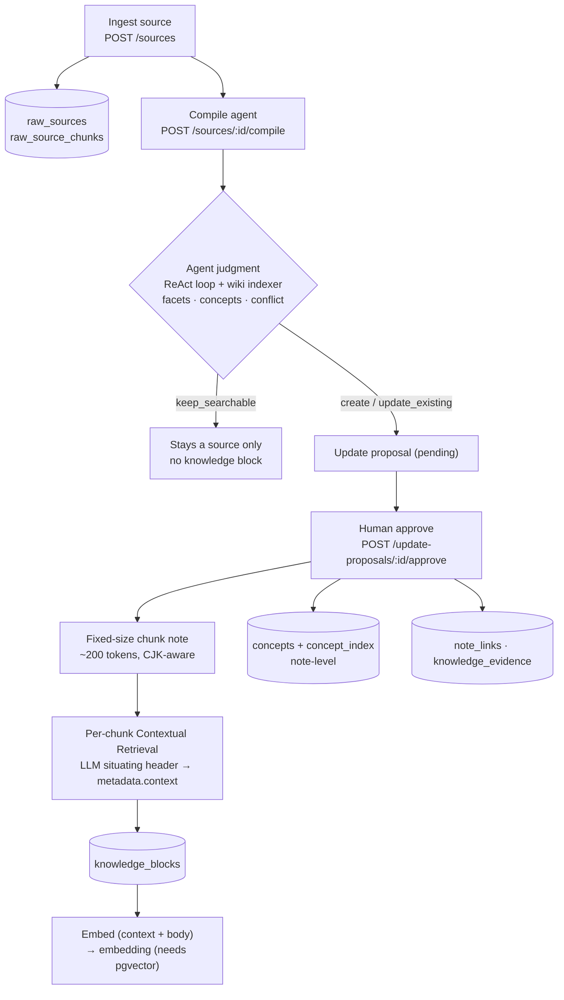
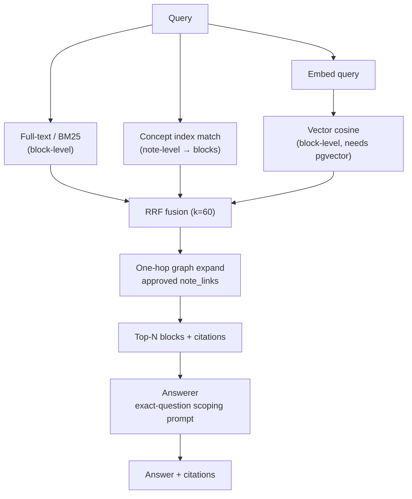

# Knowledge Compiler

Interview Knowledge Compiler turns raw interview practice notes into structured knowledge, update proposals, mistake tracking, review tasks, and readiness maps.

## Stack

- Client: React, Vite, TypeScript
- Server: Express, TypeScript
- Database: self-hosted PostgreSQL
- DB access: `postgres` with hand-written SQL
- Agent runtime: OpenAI Agents SDK

## Local Setup

Install dependencies:

```bash
npm install
```

Create local env files if they are missing:

```bash
cp .env.example .env
cp client/.env.example client/.env
cp server/.env.example server/.env
```

Start Postgres:

```bash
docker compose up -d postgres
```

Apply migrations:

```bash
npm run migrate
```

Run the API:

```bash
npm run dev:server
```

Run the client:

```bash
npm run dev:client
```

The client runs on `http://localhost:5173`.

The API runs on `http://localhost:4000`.

## Embeddings And Eval

`pgvector` powers semantic search over approved `knowledge_blocks`. The
`docker compose` Postgres service uses the `pgvector/pgvector:pg16` image, which
bundles the extension; `db/init/01-enable-pgvector.sql` enables it on first init
and migration `015` then adds the `knowledge_blocks.embedding` column.

> Without the `vector` extension, `knowledge_blocks.embedding` is never created,
> `hasEmbeddingSupport()` returns false, and **vector search is silently disabled**
> — retrieval falls back to full-text + concept ranking only.

If you previously ran the plain `postgres:16` image, the existing data volume has
no `vector` extension and migration 015 already ran (and skipped the column). Recreate
the volume so it initializes with pgvector (dev data is reconstructable from `seed-notes/`):

```bash
docker compose down -v
docker compose up -d postgres
npm run migrate
# repopulate the dev corpus through the real ingest -> compile -> approve pipeline:
npm run seed --workspace=server -- --yes
```

To embed any active blocks that are missing embeddings:

```bash
npm run backfill:embeddings --workspace=server
```

Verify the extension and column are present:

```bash
docker exec -it knowledge-compiler-postgres \
  psql -U knowledge -d knowledge_compiler \
  -c "select extname from pg_extension where extname='vector';" \
  -c "select count(embedding) as with_emb, count(*) as total from knowledge_blocks;"
```

Run the offline golden eval set:

```bash
npm run eval --workspace=server
```

To add an eval case, create a folder under `server/tests/fixtures/eval-cases/` with `source.md`, `expected.json`, and optional `meta.json` / `existing-block.md`. Keep `expected.json` focused on required concepts, forbidden hallucinations, conflict expectation, and minimum coverage/grounding scores.

## System Architecture

The system is a two-tier knowledge base: raw **sources** are preserved verbatim,
and an agent promotes the reusable parts into a canonical **knowledge** corpus
that retrieval answers from.

> Editable diagram: [`docs/architecture.excalidraw`](docs/architecture.excalidraw)
> — drag it into [excalidraw.com](https://excalidraw.com) or the desktop app
> (regenerate with `node docs/gen-architecture-excalidraw.mjs`).

### Storage tiers

| Tier | Tables | Role |
| --- | --- | --- |
| Source (provenance) | `raw_sources`, `raw_source_chunks` | Original ingested content, kept verbatim. Never destroyed. |
| Knowledge (canonical) | `knowledge_sources`, `knowledge_versions`, `knowledge_blocks`, `compiled_notes` | Deduped, versioned, retrievable knowledge. The corpus `/ask` grounds on. |
| Concept graph | `concepts`, `concept_index`, `note_links` | LLM-extracted concepts (note-level) and links between notes. |
| Provenance links | `knowledge_evidence` | Ties knowledge back to the source spans it came from. |

### Indexing layer — ingest → compile → approve

An agent reads each source, extracts structured facets, and **judges** whether it
should become knowledge. Only approved knowledge is chunked, contextualized, and
embedded.



### Retrieval layer — hybrid fusion + graph expansion

`/ask` and `/search` retrieve over `knowledge_blocks` by fusing three signals with
Reciprocal Rank Fusion, then expand one hop along the concept/link graph before
the answerer composes a scoped, cited answer.



### Design philosophy

- **Two tiers, three separate axes.** *Provenance* (keep originals), *retrievability*
  (be findable), and *canonicalization* (be authoritative) are independent. Sources
  are preserved; knowledge is the curated, deduped layer.
- **Human-in-the-loop gates the corpus.** Nothing enters `knowledge_blocks` without
  an approved proposal, so retrieval answers from vetted material.
- **Agentic judgment protects quality.** The compile agent's keep / create / update /
  conflict decision keeps personal notes, TODOs, and contradicted drafts out of the
  authoritative corpus.
- **Mechanical boundaries, LLM for context.** Following Anthropic's Contextual
  Retrieval, chunk *boundaries* are mechanical (fixed-size); the LLM is spent on a
  per-chunk *situating context*, not on segmentation.
- **Hybrid retrieval, complementary granularities.** The concept graph gives global
  recall and term disambiguation at *note* level; vector + contextual headers give
  local precision at *chunk* level; BM25 covers exact lexical matches. RRF fuses them.

### Known gaps (tracked)

- `/search` now covers both tiers (knowledge-first, with `tier`-tagged raw sources, #143); `/ask` still grounds on `knowledge_blocks` only (labeled source fallback is a follow-up).
- Vector search requires pgvector; without it retrieval silently degrades to
  full-text + concept only. CJK full-text needs a segmenting parser (#144).
- Concept matching is substring-based; query-side concept extraction is pending (#142).

## Server Architecture

The server follows a clean architecture-style folder split:

```text
server/src/controllers   HTTP request/response adapters
server/src/routes        Express route registration and route middleware
server/src/services      Application use cases and business flow
server/src/repositories  Persistence interfaces and SQL-backed implementations
server/src/domain        Shared domain types
server/src/middleware    Cross-cutting Express middleware
server/src/validators    Boundary validation schemas
server/src/db            Postgres client and migration runner
server/db/migrations     Versioned SQL migrations
server/tests             Service and validation tests
```

Routes should stay thin. Controllers should translate HTTP calls into service calls. Services should not contain raw SQL. Repositories own database queries.
